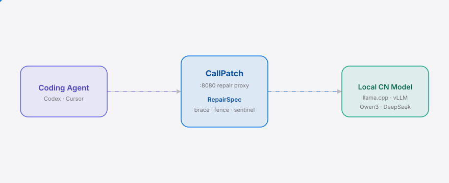
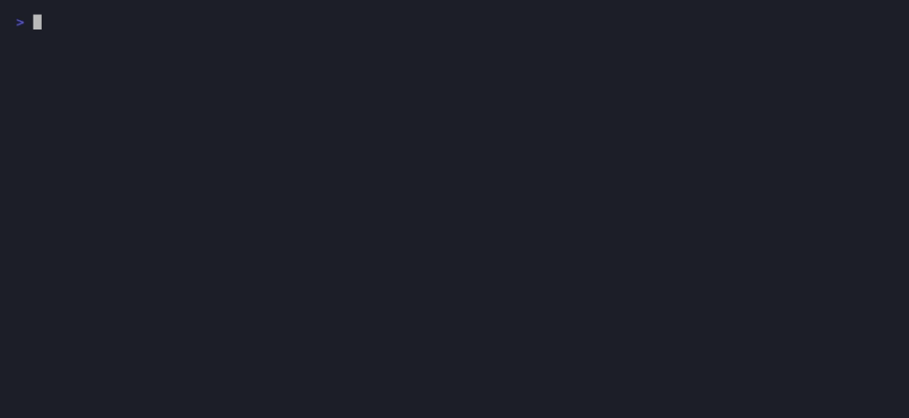

[English](./README.en.md) | **简体中文**

<picture>
  <source media="(prefers-color-scheme: dark)" srcset="./assets/hero-dark.svg">
  <source media="(prefers-color-scheme: light)" srcset="./assets/hero-light.svg">
  
</picture>

<p align="center"><sub>本地 CN 模型 tool-call JSON 运行期修复代理，让 Claude Code 接 Qwen3/DeepSeek 不再静默崩溃</sub></p>

<p align="center">
  <a href="./LICENSE"></a>
  <a href="https://github.com/SuperMarioYL/callpatch/releases"></a>
  <a href="https://github.com/SuperMarioYL/callpatch/actions/workflows/ci.yml"></a>
  
  
  
</p>

> **本地 Qwen3/DeepSeek 流式响应里的畸形 tool-call envelope，被 CallPatch 在运行期修好——Coding Agent 接本地后端不再静默崩溃。**

<h2> 架构</h2>

<picture>
  <source media="(prefers-color-scheme: dark)" srcset="./assets/atlas-dark.svg">
  <source media="(prefers-color-scheme: light)" srcset="./assets/atlas-light.svg">
  
</picture>

一个进程、两层、没有微服务：`internal/proxy` 是面向 `/v1/chat/completions` 的 `net/http` 反向代理（m2 起在流内修复）；`internal/repair` + `internal/spec` 是按模型查表的 RepairSpec 修复流水线，在每请求的 SSE delta 缓冲上跑 brace/fence/sentinel 修复，再吐出干净的 OpenAI `tool_calls` delta。无数据库、无鉴权、无 TLS——一个二进制，跨平台。

## 目录

- [为什么需要](#为什么需要)
- [安装](#安装)
- [快速开始](#快速开始)
- [用法](#用法)
- [对比](#对比)
- [Demo](#demo)
- [路线图](#路线图)
- [License](#license)
- [分享](#分享)

<h2> 为什么需要</h2>

把 Claude Code / Codex 指向本地 llama.cpp 跑 Qwen3，会话经常在 tool-call 中段静默死掉——模型的 chat template 发出的 tool-call envelope JSON 形状，OpenAI 兼容 harness 当初没按它写；本地服务器的 SSE 流式 emulation 相对云 API 又会丢/截断片段。CallPatch 不改 chat template、不改推理服务、也不改 Agent：只在 SSE 流上拦截并修好 envelope，再把干净的 OpenAI `tool_calls` delta 重新发出去。

这是 Coding Agent 浪潮接上中国 surface 的具体一瞬：Claude Code / Codex 成了主流开发工作流，Qwen3 / DeepSeek-V3 级模型在本地也到了能写代码、能调工具的可用线，llama.cpp / vLLM 也都给出了 OpenAI 兼容的 `/v1/chat/completions` 流式端点——三者交集在最近 6–12 个月才真正成立。可这个交集正好坏在 envelope 边界：模型 chat template 的 tool-call JSON 形状、本地服务器有损的 SSE 流式，都不是云端 API 出身的 Agent harness 当初写来容忍的。[headroomlabs-ai/headroom](https://github.com/headroomlabs-ai/headroom) 这类 Coding Agent 正是会撞上这堵墙的 Agent；Unsloth 已经为 Claude-Code/Codex 接本地模型打包了一个“self-healing tool calls”，但锁在它自己的 Desktop runner 里——CallPatch 把这层修复拆出来，做成 agent-agnostic 的独立中间件。

<h2> 安装</h2>

需要 Go 1.24+。国内网络建议先设代理加速依赖：

```bash
go env -w GOPROXY=https://goproxy.cn,direct
go install github.com/SuperMarioYL/callpatch/cmd/callpatch@latest
```

也可从源码构建：

```bash
git clone https://github.com/SuperMarioYL/callpatch.git
cd callpatch && go build -o callpatch ./cmd/callpatch
```

<h2> 快速开始</h2>

从冷克隆到首个可见结果，三步以内：

```bash
go install github.com/SuperMarioYL/callpatch/cmd/callpatch@latest
callpatch repair --trace testdata/qwen3-broken.sse
```

<details><summary>示例输出</summary>

```
repaired: qwen3 call[0] get_weather — strategies=[restitch_fence unescape_quotes brace_balance] in=41 out=34 ok
{
  "_repaired": true,
  "function": {
    "arguments": "{\"city\":\"北京\",\"unit\":\"celsius\"}",
    "name": "get_weather"
  },
  "id": "call_01",
  "index": 0,
  "type": "function"
}
```

stderr 是修复轨迹（`repaired: ...`），stdout 是修好的 tool-call JSON。一条 ````json` 围栏被截断 + 参数 JSON 被截断的 Qwen3 轨迹，被原地修成干净的 `{"city":"北京","unit":"celsius"}`。

</details>

<h2> 用法</h2>

v0.1 是修复内核：`callpatch repair` 读一条 OpenAI 兼容的 SSE 失败轨迹，重组 tool-call delta、按模型查 RepairSpec、跑确定性修复，把干净的 tool-call JSON 打到 stdout。

```bash
# 自动按 SSE 里的 model 字段选 RepairSpec（默认回退 qwen3）
callpatch repair --trace testdata/qwen3-broken.sse

# 指定模型，强制走 deepseek-v4 spec
callpatch repair --model deepseek-v4 --trace testdata/deepseek-broken.sse
```

| 参数 | 类型 | 默认 | 含义 |
|---|---|---|---|
| `<file.sse>` | 路径 | — | OpenAI 兼容 SSE 失败轨迹（必填） |
| `--trace` | bool | false | 把修复轨迹打到 stderr（模型、策略、进出字节数） |
| `--model` | string | 自动 | `qwen3` 或 `deepseek-v4`，覆盖流里探测到的模型名 |

三种已修复的失败模式（见 `testdata/*.sse`）：

- `qwen3-broken.sse` — `fence_split_across_chunks`：` ```json ` 围栏的闭合 fence + 闭合花括号在流尾丢失。
- `qwen3-truncated.sse` — `truncated_json`：delta 重组的参数 JSON 在值中段被截断。
- `qwen3-unbalanced.sse` — `unbalanced_braces`：嵌套对象的两个闭合花括号被丢。
- `deepseek-broken.sse` — `strip_sentinels` + `truncated_json`：`<｜tool▁call▁arguments▁begin｜>` sentinel 泄进参数 + 截断。

> m2 起 `callpatch serve --upstream http://127.0.0.1:8081 --listen :8080` 把同一套修复跑在真实流内（代理模式），v0.1 仅离线 `repair`。

<h2> 对比</h2>

CallPatch 是运行期修复中间件，不是一整个 Agent。和 Coding Agent 比，定位互补而非替代——下面也标出它更好的那行：

| 维度 | CallPatch | [headroomlabs-ai/headroom](https://github.com/headroomlabs-ai/headroom) |
|---|---|---|
| 运行期 tool-call JSON 修复 | ✓ | — |
| 本地 CN 模型（Qwen3/DeepSeek）适配 | ✓ | partial |
| agent-agnostic（任意 OpenAI 兼容 Agent 可接） | ✓ | — |
| 开箱即用的完整 Coding Agent | — | ✓ |
| 单一二进制、零依赖部署 | ✓ | partial |

<h2> Demo</h2>

两条录制失败轨迹（Qwen3 围栏截断 + DeepSeek sentinel 泄漏）被原地修好：



`docs/demo.tape` 是这条 demo 的 [vhs](https://github.com/charmbracelet/vhs) 脚本；`.github/workflows/demo.yml` 在手动触发时重新渲染 `assets/demo.gif`。

<h2> 路线图</h2>

- [x] **m1 修复内核** — Qwen3 RepairSpec + SSE delta 重组器 + brace/fence 修复；`callpatch repair --trace` 修复 3 条录制失败轨迹。
- [ ] **m2 代理服务** — `:8080` HTTP/SSE 反向代理转发到 `--upstream`，流内修复，重新吐干净的 OpenAI SSE；Codex → CallPatch → llama.cpp 跑通一个原来会死的工具任务。
- [ ] **m3 DeepSeek demo** — DeepSeek RepairSpec + 双模型修复 demo + README 定稿，仓库达到 Show-HN-ready。
- [ ] 未来 — 社区 RepairSpec PR、更多模型（GLM/Intern）、Claude-Code-native 协议、修复回归语料。

<h2> License</h2>

MIT，见 [LICENSE](./LICENSE)。提 issue 或 PR 都欢迎——尤其欢迎把你撞到的畸形 envelope 附在 `testdata/*.sse` 里一起发上来。

## 分享

```
CallPatch — 本地 Qwen3/DeepSeek tool-call JSON 的运行期修复。把畸形的 SSE envelope 在飞行中修好，Coding Agent 接本地后端不再静默崩溃。https://github.com/SuperMarioYL/callpatch
```

<p align="center"><sub><a href="./LICENSE">MIT</a> © 2026 SuperMarioYL</sub></p>
